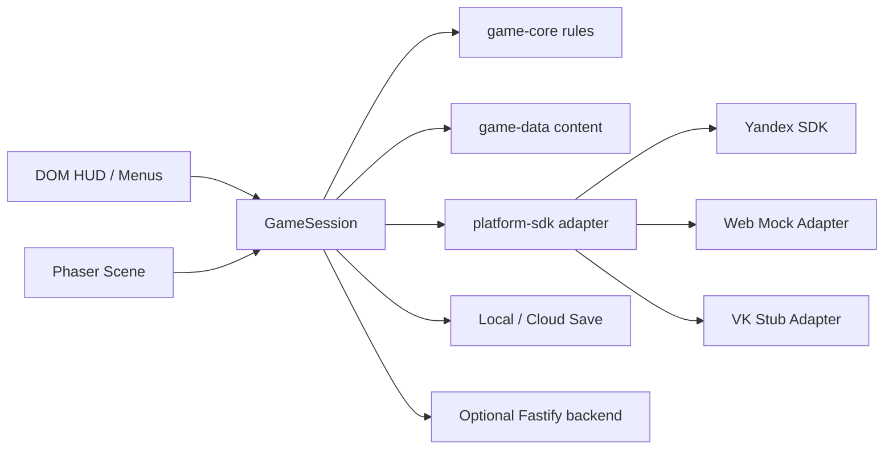

# Technical Architecture

## Goals

- Keep gameplay logic platform-agnostic.
- Isolate Yandex-specific code inside adapters.
- Support local development without backend or platform SDK access.
- Keep content, monetization, experiments, and saves data-driven.

## Repository Structure

- `apps/game-web`: Phaser + DOM-shell web client.
- `services/backend`: Fastify backend for config, experiments, liveops, and analytics ingestion.
- `packages/game-core`: pure gameplay, economy, save, progression, runtime orchestration.
- `packages/game-data`: hand-authored early levels, procedural level tail, quests, chapters, daily rewards, shop catalog, and content validation.
- `packages/platform-sdk`: interfaces and platform adapters.
- `packages/analytics`: event schemas and tracker.
- `packages/shared`: IDs, logger, shared types, utility helpers.
- `packages/config`: build profiles and default remote config.

## Runtime Split

## Game Client

### `apps/game-web`

- `src/main.ts`: bootstraps logger, build target, platform adapter, and session.
- `src/app.ts`: DOM overlay, screens, CTA handling, map/shop/settings UI.
- `src/phaser/GameRenderer.ts`: Phaser host lifecycle.
- `src/phaser/BubbleLevelScene.ts`: rendering and input bridge for bubble gameplay.

### Design choice

Phaser owns motion, playfield rendering, and input sampling. DOM owns high-density UI, readability, and responsiveness. This matches mobile web constraints and keeps menus cheap to iterate.

## `game-core`

### Board systems

- `board/board.ts`: board creation from level data.
- `board/shot.ts`: shot preview and pathing.
- `board/resolution.ts`: shot application, matching, drops, and fail/win resolution.

### Progression systems

- `save/schema.ts` and `save/migrations.ts`: versioned save format.
- `save/service.ts`: local/cloud load/write with recovery and logging.
- `economy/economy.ts`: reward application and offer effects.
- `progression/dailyRewards.ts`: reward cadence and streaking.
- `progression/restoration.ts`: meta restoration and star totals.
- `quests/quests.ts`: quest progress and claim logic.
- `features/featureFlags.ts`: experiment assignment helpers.
- `tutorial/tutorial.ts`: tutorial state machine.
- `runtime/gameSession.ts`: app-facing orchestration layer.

## Platform Layer

## Interfaces

- `IPlatformAuth`
- `IPlatformAds`
- `IPlatformPurchases`
- `IPlatformStorage`
- `IPlatformCloudSave`
- `IPlatformLeaderboards`
- `IPlatformLocale`
- `IPlatformServerTime`
- `IPlatformAnalytics`
- `IPlatformRemoteConfig`
- `IPlatformLogging`

These are represented inside `packages/platform-sdk/src/interfaces.ts` and composed into `PlatformAdapter`.

### Adapters

- `adapters/yandex.ts`: official SDK integration for ads, payments, flags, locale, leaderboards, server time, and loading/gameplay lifecycle.
- `adapters/mock.ts`: local-first adapter used for development, tests, and smoke flows.
- `adapters/vk.ts`: TODO-ready shell for later VK integration.

## Backend

### Service responsibilities

- `/config`: remote config delivery.
- `/experiments/assign`: experiment assignment stub.
- `/events`: analytics ingestion endpoint.
- `/liveops`: event schedule payload.
- `/shop`: shop configuration endpoint.
- `/content`: content version registry.
- `/health` and `/ready`: operational checks.

### Persistence

- Prisma schema targets SQLite for local development.
- Schema choices are compatible with later PostgreSQL migration.

## Save Strategy

- Local save is always available.
- Cloud save is used when the platform exposes it.
- Save schema is versioned and migrated before parse.
- Corrupted saves fall back to a default profile instead of blocking boot.
- Writes emit analytics and structured logs.

## Build Targets

- Local: mock adapter, verbose debugging.
- Yandex: Yandex adapter, SDK boot, platform monetization.
- VK: stub adapter for future porting.
- Test: mock adapter plus unit/integration harnesses.

## Packaging

- `pnpm build:yandex` builds the client with Yandex mode.
- `pnpm pack:yandex` rebuilds the Yandex profile, validates file names and size budget, and creates a zip with `index.html` at archive root.

## Observability

- Structured logger in `packages/shared/src/log.ts`.
- Shared session context: session ID, anonymous ID, app version, build target, platform target.
- Analytics tracker in `packages/analytics`.
- Dev debug overlay in the web client when `?debug=1` or local build is used.

## Failure Handling

- SDK init failures are tracked and surfaced.
- Mock adapter keeps local development unblocked.
- Save corruption falls back safely.
- Visibility changes move gameplay into a paused/settings state.

## Portability Notes

- Core rules do not depend on Phaser or Yandex.
- Build-profile and adapter boundaries allow future VK or portal-specific integrations without rewriting level logic, save logic, or economy.
